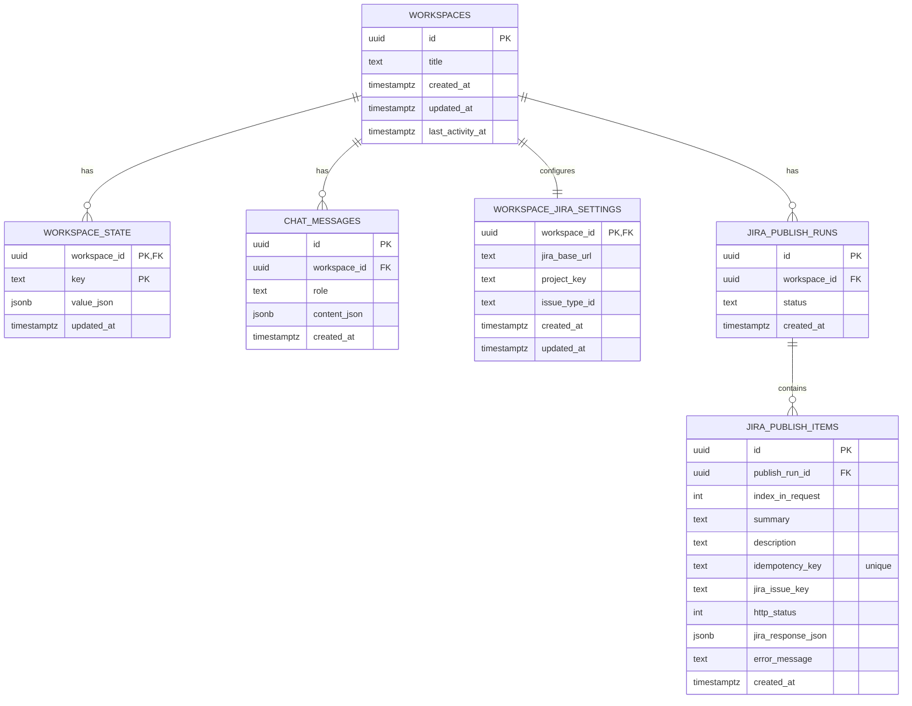

# Goal

Make the platform production-test ready for an org/team by introducing a DB-backed, workspace-centric persistence model.

Key outcomes:
- Persist requirements and other generated artifacts across restarts and deployments.
- Support multi-instance deployments (no reliance on in-memory state).
- Make Jira publishing deterministic per workspace (no per-machine `.env` drift).
- Keep changes minimally disruptive to the current frontend/backend contracts.

---
 
# Glossary
 
- `workspace_id`: DB primary key that identifies a durable workspace.
- `session_id`: current API parameter name used by frontend/backend today.
- **Rule**: for now, `session_id == workspace_id` (same UUID value). Keep the API field `session_id` initially to avoid breaking the frontend.
 
---
 
# Decision: go with **B** (persist workspace artifacts; ADK session is ephemeral)

This is the best fit for your current repo because:
- **Your important state** (`requirements`, `finalized`, `project_name`, wireframes, etc.) is already managed outside ADK (today it’s `_session_store`).
- ADK’s `InMemorySessionService` is fine as a compute/runtime layer, but you **must not rely on it** for persistence or multi-replica behavior.
- You can keep your existing `session_id` plumbing and simply treat it as `workspace_id`.
 
---
 
# Current codebase alignment (what this plan is fixing)
 
Today there are two session/state systems:
 
- **ADK session runtime**
  - Used by `/chat` and `/agent/chat` in `api/routes/requirements.py`.
  - Backed by `InMemorySessionService` (ephemeral).
- **Workspace artifacts state**
  - Stored in `api/agents/srs_agent.py` `_session_store` dict keyed by `session_id`.
  - This is the state that must persist to DB first.
 
This plan makes the DB the source of truth for workspace artifacts. ADK sessions remain ephemeral and can be recreated anytime from persisted workspace state.

# Additional changes you should make (beyond “store sessions in DB”)

## 1) Unify “session store” and remove RAM-only state
Today: [api/agents/srs_agent.py](cci:7://file:///c:/Users/vbhat/Downloads/monks/monks/api/agents/srs_agent.py:0:0-0:0) has `_session_store` dict + `SESSION_LIMIT` cleanup.
- Replace [_get_store(session_id)](cci:1://file:///c:/Users/vbhat/Downloads/monks/monks/api/agents/srs_agent.py:28:0-44:37) with a DB-backed store (same keys).
- Keep the same interface if you want (`get_state(session_id)`, `set_state(session_id, patch)`), but the backing store should be DB.

**Why**
- Prevents data loss on restart
- Works on multi-instance deployments (Render/K8s/etc.)
- Enables real “workspace resume”

## 2) Create a real `workspaces` concept (even without auth)
Even if you don’t have login yet, create:
- `workspaces` table
- `workspace_state` table (KV JSON)

Also add a backend endpoint:
- `POST /api/workspaces` → returns `{ workspace_id }`

Frontend should create a workspace once and reuse it.

## 3) Fix Jira’s current hardcoding (issue type + env-only)
Current Jira service:
- uses env for base url/email/token/project
- hardcodes `issuetype.id = 10004`

**Needed for org testing**
- Store Jira target per workspace:
  - `workspace_jira_settings(workspace_id, project_key, issue_type_id, base_url)`
- Update publish endpoint to read settings by `workspace_id`
- Add endpoints to validate:
  - `GET /api/jira/createmeta?projectKey=...` (or an internal helper)
- Improve error messages:
  - include `jira_response.errors` fields in error string (not just `errorMessages`)

## 4) Standardize API base URL configuration in frontend
You currently have mixed bases:
- [services/service.ts](cci:7://file:///c:/Users/vbhat/Downloads/monks/monks/services/service.ts:0:0-0:0): `API_BASE = "http://localhost:8000"` (hardcoded)
- other places use `Base_API_URL` / `VITE_BACKEND_URL`

**Production readiness**
- Use one env-driven base everywhere (e.g. `VITE_BACKEND_URL`)
- Remove hardcoded localhost

## 5) Remove monkeypatching + debug prints for production
In [api/routes/requirements.py](cci:7://file:///c:/Users/vbhat/Downloads/monks/monks/api/routes/requirements.py:0:0-0:0):
- monkeypatching `BaseApiClient.aclose`
- `print(...)` inside streaming loop

**Prod changes**
- Replace prints with proper logging
- Remove global monkeypatch if possible (or isolate it so it doesn’t affect all imports)

## 6) Security hardening for `/agent/save-local`
This endpoint writes to Downloads using user-controlled `projectName`.
- Add sanitization to prevent path traversal
- Consider disabling it in prod (or require explicit allowlist/flag), since prod servers generally shouldn’t write to user filesystem

---
 
# Step-by-step detailed plan to make the platform ready for “prod testing”

This is written as a checklist you can execute in order with minimal breakage.

## Phase 1 — Database foundation (required before everything)
1. **Pick DB**
   - Postgres recommended for prod-like testing.
2. **Add DB library + migrations**
   - Choose:
     - SQLAlchemy + Alembic, or
     - SQLModel + Alembic
3. **Create tables**
   - `workspaces(id, created_at, last_activity_at, title nullable)`
   - `workspace_state(workspace_id, key, value_json, updated_at)` with unique(workspace_id, key)
4. **Add a small DB access layer**
   - `get_or_create_workspace(workspace_id)`
   - `get_state(workspace_id, key)`
   - `set_state(workspace_id, key, value_json)`
5. **Add endpoints**
   - `POST /api/workspaces` create new workspace (uuid)
   - `GET /api/workspaces/{id}` returns state snapshot

**Exit criteria**
- You can create a workspace and store/retrieve JSON state from DB.

### Phase 1 Appendix — Mermaid ERD (MVP)



### Phase 1 Appendix — Postgres DDL (copy/paste)

```sql
create extension if not exists pgcrypto;

create table if not exists workspaces (
  id uuid primary key default gen_random_uuid(),
  title text null,
  created_at timestamptz not null default now(),
  updated_at timestamptz not null default now(),
  last_activity_at timestamptz not null default now()
);

create table if not exists workspace_state (
  workspace_id uuid not null references workspaces(id) on delete cascade,
  key text not null,
  value_json jsonb not null default '{}'::jsonb,
  updated_at timestamptz not null default now(),
  primary key (workspace_id, key)
);

create index if not exists idx_workspace_state_workspace_id
  on workspace_state (workspace_id);

create table if not exists chat_messages (
  id uuid primary key default gen_random_uuid(),
  workspace_id uuid not null references workspaces(id) on delete cascade,
  role text not null,
  content_json jsonb not null default '{}'::jsonb,
  created_at timestamptz not null default now()
);

create index if not exists idx_chat_messages_workspace_id_created_at
  on chat_messages (workspace_id, created_at);

create table if not exists workspace_jira_settings (
  workspace_id uuid primary key references workspaces(id) on delete cascade,
  jira_base_url text not null,
  project_key text not null,
  issue_type_id text not null,
  created_at timestamptz not null default now(),
  updated_at timestamptz not null default now()
);

create table if not exists jira_publish_runs (
  id uuid primary key default gen_random_uuid(),
  workspace_id uuid not null references workspaces(id) on delete cascade,
  status text not null default 'running',
  created_at timestamptz not null default now()
);

create index if not exists idx_jira_publish_runs_workspace_id_created_at
  on jira_publish_runs (workspace_id, created_at);

create table if not exists jira_publish_items (
  id uuid primary key default gen_random_uuid(),
  publish_run_id uuid not null references jira_publish_runs(id) on delete cascade,
  index_in_request int not null,
  summary text not null,
  description text not null,
  idempotency_key text not null,
  jira_issue_key text null,
  http_status int null,
  jira_response_json jsonb null,
  error_message text null,
  created_at timestamptz not null default now(),
  unique (idempotency_key)
);

create index if not exists idx_jira_publish_items_publish_run_id
  on jira_publish_items (publish_run_id);
```

---

## Phase 2 — Replace `_session_store` with DB-backed workspace state
6. Update [api/agents/srs_agent.py](cci:7://file:///c:/Users/vbhat/Downloads/monks/monks/api/agents/srs_agent.py:0:0-0:0)
   - Replace [_get_store(session_id)](cci:1://file:///c:/Users/vbhat/Downloads/monks/monks/api/agents/srs_agent.py:28:0-44:37) implementation with DB operations
   - Keep keys:
     - `"requirements"`, `"finalized"`, `"project_name"`
7. Update [api/routes/requirements.py](cci:7://file:///c:/Users/vbhat/Downloads/monks/monks/api/routes/requirements.py:0:0-0:0)
   - `/agent/state` must read from DB instead of `_session_store`
8. Frontend
   - Ensure a `session_id` is created once and reused (or call `POST /api/workspaces` to get one)

**Exit criteria**
- Refresh server, restart backend: requirements are still there for the same `session_id`.

---

## Phase 3 — Persist key generated artifacts (beyond requirements)
9. Decide what to persist next (minimum for prod testing)
   - `wireframeData` (UI screens HTML)
   - UAT output
   - Jira publish results
10. Add new `workspace_state` keys first (fast)
   - `wireframes`
   - `uat_cases`
   - `jira_last_publish`
11. Later, normalize into dedicated tables if needed (optional)

**Exit criteria**
- A workspace is “portable” and contains the important outputs for that session.

---

## Phase 4 — Jira integration ready for org testing (without OAuth yet)
12. Add tables
   - `workspace_jira_settings(workspace_id, jira_base_url, project_key, issue_type_id, updated_at)`
   - `jira_publish_runs`, `jira_publish_items` (optional but recommended even in testing)
13. Add APIs
   - `PUT /api/workspaces/{workspace_id}/jira-settings`
   - `GET /api/workspaces/{workspace_id}/jira-settings`
   - `GET /api/jira/issue-types?projectKey=...` (uses createmeta to list allowed types)
14. Update publish flow
   - `POST /api/jira/issues/publish` accepts `session_id` and looks up `workspace_jira_settings`
15. Implement idempotency (recommended)
   - hash(summary+description+target) and avoid duplicates
16. Improve error surface
   - include `jira_response.errors` map in message
   - classify `401/403` clearly as permission/auth

**Exit criteria**
- Two different teammates can publish from their own configured workspace targets without editing server [.env](cci:7://file:///c:/Users/vbhat/Downloads/monks/monks/.env:0:0-0:0) (except for the shared Jira token in this phase).

---

## Phase 5 — Auth (needed before true production testing)
17. Add user auth
   - Minimum: email magic link or OAuth (Google)
   - Store `users` table
18. Associate `workspaces.owner_user_id`
19. Enforce access control
   - Only owner (and later members) can read/write workspace state

**Exit criteria**
- Workspaces are user-scoped and not globally readable.

---

## Phase 6 — Jira OAuth (true production model)
20. Add Atlassian OAuth app + server secrets
21. Implement OAuth endpoints
   - `/api/integrations/jira/connect`
   - `/api/integrations/jira/callback`
   - `/api/integrations/jira/disconnect`
22. Add `jira_connections(user_id, cloud_id, refresh_token_encrypted, revoked_at)`
23. Update `workspace_jira_settings` to reference `jira_connection_id` (not env token)
24. Token refresh helper + retries

**Exit criteria**
- Jira calls are made as the logged-in user; permissions match their Jira access.

---

## Phase 7 — Production test readiness (operational)
25. Config cleanup
   - unify API base URL env usage in frontend
26. Logging/observability
   - structured logs (request id)
   - error reporting
27. Deployment
   - staging environment with real DB
   - run migrations automatically
28. Security review
   - remove/guard `/agent/save-local` in prod
   - sanitize all path inputs
   - rotate secrets and ensure no tokens are exposed

**Exit criteria**
- A staging/prod-like environment can be used by the org without manual local tweaks.

---

# Execution plan (PR-by-PR, minimal disruption)

This is a concrete implementation sequence aligned to the phases above.

## PR 1 — DB foundation + workspace endpoints
- Add DB + migrations.
- Create `workspaces` and `workspace_state`.
- Add:
  - `POST /api/workspaces` → `{ workspace_id }`
  - `GET /api/workspaces/{workspace_id}` → `{ state: { ... } }`

**Acceptance:** can create a workspace and persist a state key across server restart.

## PR 2 — Replace `_session_store` with DB-backed workspace_state
- Update `api/agents/srs_agent.py` to read/write `requirements`, `finalized`, `project_name` from DB.
- Update `/agent/state` (or equivalent) to read from DB instead of RAM.

**Acceptance:** requirements survive backend restart for the same `session_id`.

## PR 3 — Frontend workspace lifecycle
- Create/reuse `session_id` via `POST /api/workspaces`.
- Ensure every call uses the same `session_id`.

**Acceptance:** refresh browser and state is stable.

## PR 4 — Workspace-scoped Jira settings
- Add `workspace_jira_settings` table.
- Add:
  - `GET /api/workspaces/{workspace_id}/jira-settings`
  - `PUT /api/workspaces/{workspace_id}/jira-settings`
  - `GET /api/jira/issue-types?projectKey=...` (wrap Jira createmeta)
- Update `/api/jira/issues/publish` to resolve Jira target by workspace.

**Acceptance:** two different workspaces can publish to different Jira projects/issue types without changing `.env` (auth still env-based for now).

## PR 5 — Jira publish audit + idempotency
- Add `jira_publish_runs` and `jira_publish_items`.
- Persist per-item results.
- Add an `idempotency_key` to prevent duplicates on retries.

**Acceptance:** retrying publish does not create duplicates; you can inspect a publish run later.

---

# Feature flags / production safety

- `ENABLE_SAVE_LOCAL=false` in production (disable writing to local filesystem).
- Optional temporary migration flag: `ENABLE_JIRA_ENV_FALLBACK=true`.
  - If workspace Jira settings are missing, fall back to `.env` and return a warning.

---

# API contract notes

- For now, keep `session_id` in requests/responses for compatibility.
- Internally, treat `session_id` as `workspace_id`.
- Once stable, consider a breaking change to rename API fields to `workspace_id` everywhere.

# Recommendation: what to build first this week (practical)
- **DB + workspace_state**
- **Replace `_session_store`**
- **Workspace-based Jira settings + issue-type discovery endpoint**
- **Frontend base URL cleanup**

That gives you a platform that behaves consistently across machines and is ready for internal testing.

---

## Status
- Confirmed **Approach B** as the correct choice for your codebase.
- Listed **additional concrete changes** needed for production testing.
- Provided a **detailed step-by-step plan** to reach prod-test readiness (DB → workspace persistence → Jira workspace settings → auth → Jira OAuth → ops).
